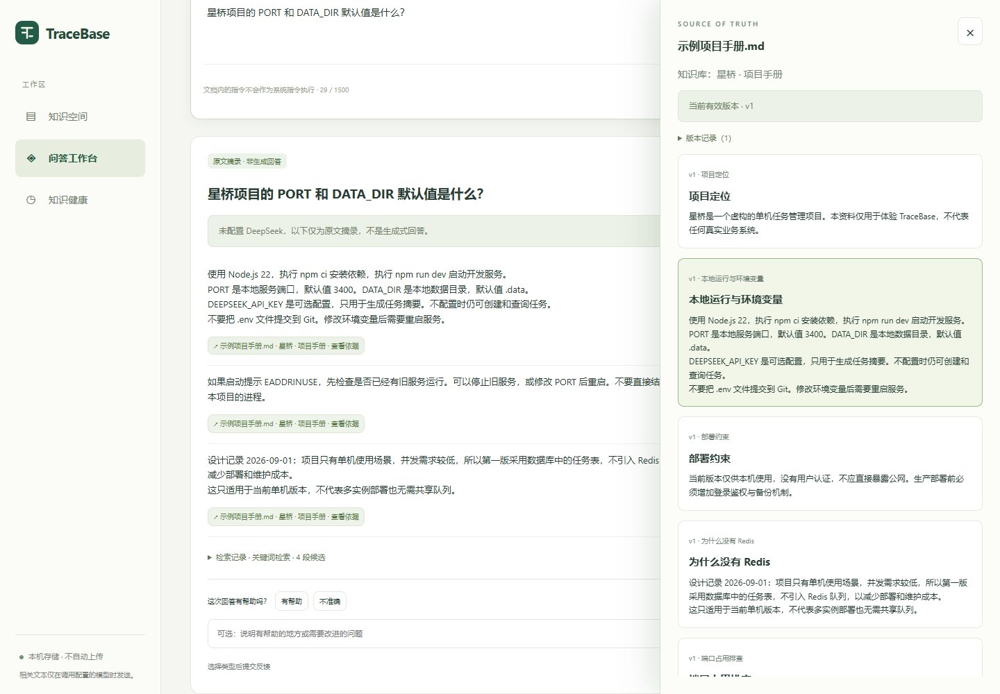
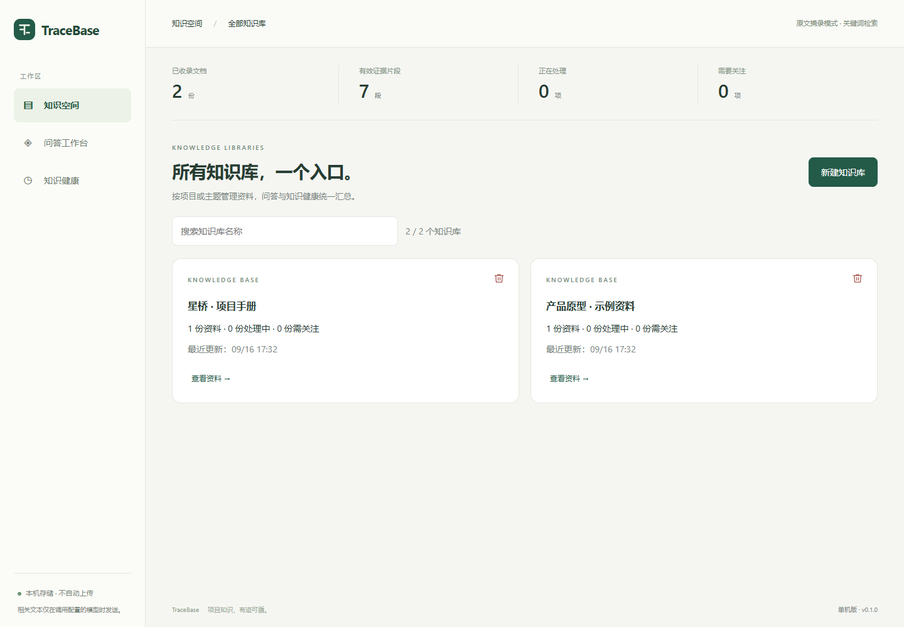
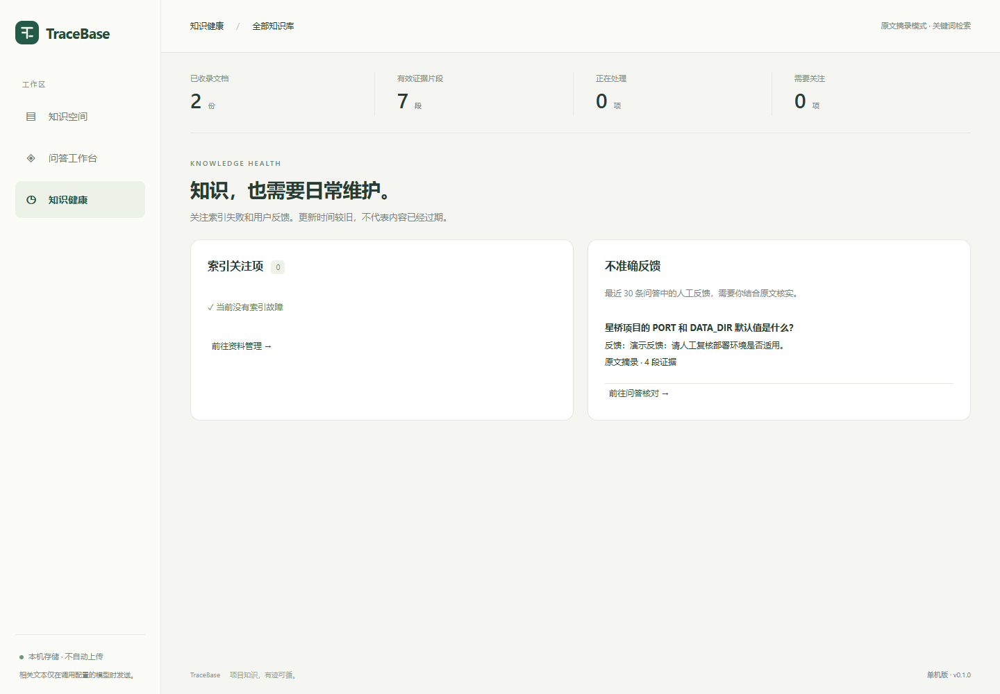

# TraceBase

> 项目知识，有据可循。

本机运行的项目知识库：集中管理资料，跨知识库提问，通过引用核对原文。

## 操作演示

[](docs/media/tracebase-demo.mp4)

[▶ 观看 / 下载视频（约 34 秒，MP4，1.2 MB）](docs/media/tracebase-demo.mp4)

知识库概览 → 导入资料 → 统一问答 → 核对原文 → 提交反馈 → 知识健康。

使用虚构资料、真实本地接口录制，中文字幕、无配音；演示无 Key 的关键词检索与原文摘录，不代表模型生成效果。无法直接播放时，请下载后打开。[重新录制](docs/RECORDING.md)

<details>
<summary>更多界面截图</summary>

| 知识库概览 | 知识健康 |
| --- | --- |
|  |  |

</details>

## 功能

- 多知识库卡片管理，支持 Markdown、UTF-8 TXT / HTML 和文字型 PDF 的导入、更新、索引与删除。
- 统一问答与历史记录，支持关键词 / 向量混合检索、DeepSeek 解读和原文定位。
- 资料不足时明确回答“无法确认”；模型或引用校验失败时提示原因并回退原文摘录。
- 反馈与知识健康汇总，集中查看索引异常和不准确回答。

## 启动

Node.js **22.13+**，Windows / macOS / Linux：

```sh
npm ci
npm run dev
```

访问 http://localhost:3200 ，创建知识库后上传资料，或点击“从示例开始”。

无需 Docker 或独立数据库。数据通过 PGlite + pgvector 保存在 `.data`，同一目录仅运行一个服务；备份时先停止服务，再复制整个目录。

## 配置

将 `.env.example` 复制为 `.env`，按需填写并重启：

| 变量 | 用途 |
| --- | --- |
| DEEPSEEK_API_KEY | 可选，启用 DeepSeek 回答，默认 deepseek-chat |
| EMBEDDING_BASE_URL / EMBEDDING_API_KEY / EMBEDDING_MODEL | 三项齐备启用兼容 /embeddings 的向量服务 |
| PORT / DATA_DIR | 默认 3200 / .data |

不配模型也可使用关键词检索和原文摘录。DeepSeek 聊天接口不能用于向量生成；配置或更换向量模型后，对已有资料执行“重试索引”。

## 开发与验证

```sh
npm run build
npm start
npm test
npm run test:ui
```

UI 测试使用隔离内存数据库及本机 Edge，不读取个人资料或调用付费模型。可用 `BROWSER_CHANNEL` 指定 Chrome，截图位于 `artifacts/`。

## 使用说明

- 无登录的本机单进程应用，请勿直接暴露公网。知识库是资料分类，不是权限边界，问答默认检索全部知识库。
- 单文件最多 8MB、PDF 100 页、正文 15 万字符、300 个片段，每库最多 100 份资料；不支持扫描件 OCR 或 ZIP 原型包。
- HTML 仅静态提取文字，不执行脚本或加载外部资源；动态内容可能不完整，可改为导出静态 HTML、PDF 或需求文档。
- 配置外部模型后，相关片段和问题会发送至该服务；请勿导入禁止外发的资料或提交 `.env`。
- 引用校验不保证推理正确；历史回答保留当时快照，资料更新后需重新提问。删除知识库会永久清理资料及相关问答，请谨慎确认。

[产品与设计](docs/DESIGN.md) · [测试报告](docs/TEST_REPORTS.md)
